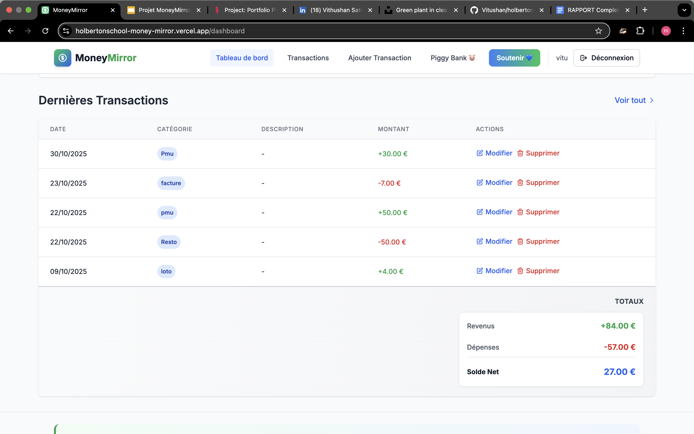

<!--
  README pour le projet "Vitrine Money Mirror".
-->

# Vitrine Money Mirror


> Un miroir clair de vos finances — visualisez, comprenez et décidez.

## Navigation rapide

- 🔗 [Intro](#introduction)
- 🔗 [Fonctionnalités](#fonctionnalites)
- 🔗 [À propos](#a-propos)
- 🔗 [Voir l'application déployée](#deploiement)

---

## Introduction

Sur cette page d'accueil vous trouverez :

- Une grande image de couverture (`./assets/cover.png`).
[Voir l'application déployée](https://holbertonschool-money-mirror.vercel.app)

## Fonctionnalites

> Ici la landing met en valeur 3 fonctionnalités clés. Remplacez les images par de vrais captures/gifs.

### 1) Tableau de bord clair


Nom : Tableau de bord central

Description : Un tableau de bord synthétique qui affiche vos soldes, tendances et alertes importantes en un coup d'œil. Idéal pour prendre des décisions rapides.

---

### 2) Visualisations graphiques


Nom : Évolution dans le temps

Description : Suivez l'évolution de vos finances avec un graphique en ligne interactif. Visualisez les tendances de votre solde sur plusieurs mois pour mieux anticiper.

---


Nom : Revenus vs Dépenses

Description : Comparez vos revenus et dépenses période par période avec un graphique en barres clair. Identifiez rapidement les périodes où vous dépensez plus que vous ne gagnez.

---


Nom : Répartition par catégorie

Description : Visualisez la répartition de vos dépenses par catégorie avec un diagramme en camembert coloré. Découvrez où va réellement votre argent.

---

### 3) Piggy Banks (Tirelires)


Nom : Piggy Banks

Description : Créez plusieurs « tirelires » virtuelles pour vos objectifs (vacances, imprévus, cadeaux). Affectez des montants récurrents ou ponctuels, définissez des priorités et suivez la progression. Les piggy banks peuvent être automatisés (règles d'arrondi, transferts programmés) pour vous aider à atteindre vos objectifs d'épargne.

---

### 4) Liste des transactions



Nom : Liste des Transactions

Description : Consultez toutes vos transactions (revenus et dépenses) dans un tableau clair et organisé. Modifiez ou supprimez vos entrées, et visualisez en temps réel vos totaux de revenus, dépenses et solde net.

---

### 5) Message de prudence


Nom : Alertes intelligentes

Description : MoneyMirror vous avertit quand vos dépenses dépassent vos revenus ou quand des comportements financiers risqués sont détectés. Restez informé pour mieux contrôler votre budget.

---

## A propos

### Mon inspiration (histoire personnelle)

Salut, je suis Vithushan, l'unique développeur derrière MoneyMirror. Comme beaucoup d'entre vous, j'ai longtemps eu du mal à gérer mes finances personnelles. Entre les dépenses imprévues, les oublis de transactions et le manque de vision claire sur mon budget, je me sentais perdu.

Un jour, après avoir dépassé mon budget mensuel pour la troisième fois d'affilée, je me suis dit : "Il doit y avoir une meilleure façon de faire." C'est à ce moment que l'idée de MoneyMirror est née.

J'ai passé des centaines d'heures à créer cette application, non pas pour devenir riche, mais pour aider les gens comme moi à reprendre le contrôle de leurs finances. Chaque ligne de code a été écrite avec passion et le désir sincère de faire une différence.

Remarque : ceci est un projet portfolio — il illustre ce que j'ai appris et les choix de conception que j'ai faits.

### Équipe

- Vithushan.S — [GitHub](https://github.com/Vitushan) • [LinkedIn](https://www.linkedin.com/in/vithushan33/)

### Répertoire du projet

Le code source est disponible ici : [Repository GitHub](https://github.com/Vitushan/holbertonschool-moneyMirror)

URL slide : [Présentation](https://docs.google.com/presentation/d/1OtzlbXKp1otEVOTNbrZG7C6BFFKYKh9MlMym6HeE0Qw/edit?slide=id.p#slide=id.p)

URL rapport : [Rapport](https://docs.google.com/document/d/1RN6_e0gwZ6dyxVRkByGGZrMq66lm_RBAbU6d5kU-0iI/edit?tab=t.0)

---

## Deploiement

Bouton :

[Voir l'application déployée](https://holbertonschool-money-mirror.vercel.app)

---

## Tester localement

Si vous avez le code source complet (frontend Node/React/etc.), voici des commandes courantes pour lancer l'application en local :

1. Installer les dépendances (si le projet utilise Node) :

```bash
npm install
```

1. Lancer le serveur de développement :

```bash
npm run dev
# ou
npm start
```
